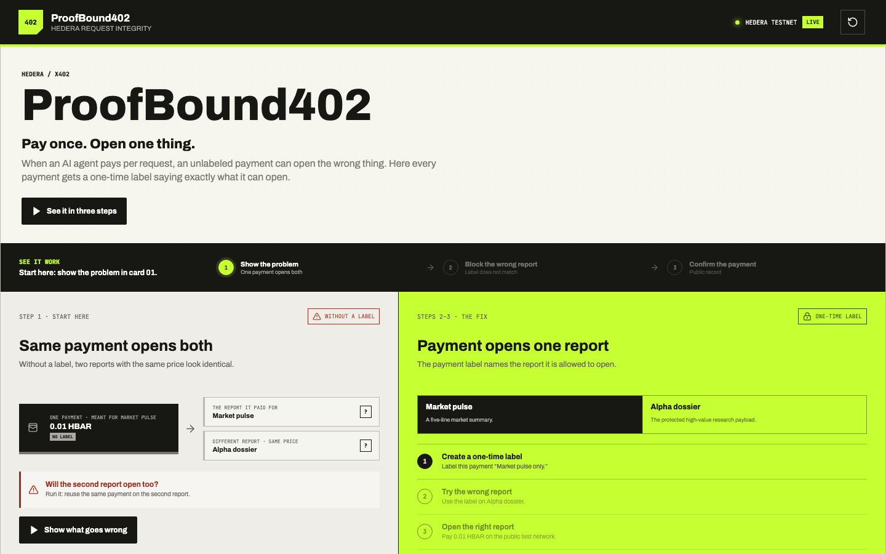
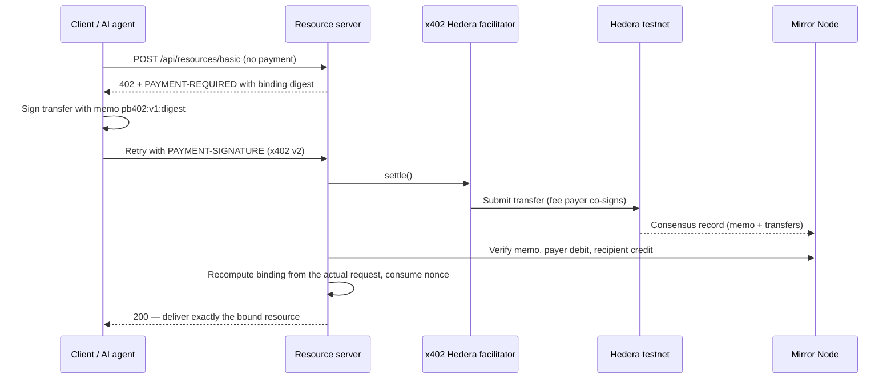

# ProofBound402

**One payment. One exact request. Publicly provable.**

When an AI agent pays for a resource with x402, the settlement proves that money moved — not what that payment was allowed to unlock. Two resources with identical price, asset, and recipient are indistinguishable to the server, so a payment for one can silently unlock the other. ProofBound402 closes that gap with Hedera itself: the exact request is committed into the payment's transaction memo, and delivery happens only after Mirror Node independently confirms it.

**▶ Try it live:** **<https://proofofbound402.aivylabs.xyz>** — running in `LIVE` mode against Hedera testnet. Click through the three steps and the payment you make is a real on-chain transaction you can open in HashScan from the page itself.

**Demo video:** _(link here — under 5 minutes)_
<!-- TODO before submission: add the demo video link above -->

**Proven on Hedera testnet, twice:**

| | Transaction | On-chain memo |
| --- | --- | --- |
| ✅ | [HashScan `…551-549343245`](https://hashscan.io/testnet/transaction/0.0.9859769-1785521551-549343245) | `pb402:v1:_ovt94J88nYyHb0vHkLxJXYGv_8hk7upJqUBfT-5o4s` |
| ✅ | [HashScan `…587-393752447`](https://hashscan.io/testnet/transaction/0.0.9859769-1785531587-393752447) | `pb402:v1:7gW57glVd5hWdHRKHd-Wm22r9QGqiPtyGcf_dz5xqVk` |

Each memo is the SHA-256 binding of a different HTTP request, and each transfer was verified through the public [Mirror Node API](https://testnet.mirrornode.hedera.com/api/v1/transactions/0.0.9859769-1785521551-549343245) — result, memo, payer debit, and recipient credit. Full verification detail in [EVIDENCE.md](./EVIDENCE.md).



## The problem, in one payment

| | Unbound x402 integration | ProofBound402 |
| --- | --- | --- |
| Payment proves | amount, asset, recipient | amount, asset, recipient **+ the exact request** |
| Same-priced resource B accepts a payment for A | **Yes — delivered** | No — `RESOURCE_MISMATCH`, fail closed |
| Replay the same payment | Depends on the integration | No — one-time nonce, consumed atomically |
| Anyone can audit what was authorized | No | Yes — the binding digest is in the public transaction memo |

The dashboard is an attack lab: it runs the exploit against a deliberately unbound integration first, then blocks the identical attempt in protected mode, then settles the honest request for real.

## Is this a real problem?

"Payment confirmed" ≠ "payment confirmed **for this exact thing**" is one of the most repeated integration vulnerabilities in payment history: in-app purchase receipts replayed across products, crypto deposits credited by matching the amount alone, web-shop integrations that verify *a* payment succeeded but never check it was for *this* order. Every new payment rail goes through this phase; x402 integrations will be no exception.

Two things make it sharper here. **Agents don't notice** — a human sees the wrong report open; an autonomous payer making hundreds of paid calls through proxies and tool-servers does not. And binding buys more than defense: because the commitment lives in the public transaction memo, **anyone can prove after the fact exactly which request a payment authorized** — dispute resolution and audit for machine-to-machine commerce, with no trust between the parties.

## Try it in 60 seconds

**Nothing to install:** open **<https://proofofbound402.aivylabs.xyz>** and follow the three guided steps. That deployment runs in `LIVE` mode, so step three settles a real Hedera testnet payment and links you straight to its HashScan record. Each visitor gets an isolated demo session, so it behaves the same no matter who else is clicking.

**Or run it yourself:**

```bash
npm install
cp .env.example .env
npm run dev
```

Open <http://localhost:5173>. Without Hedera credentials everything runs in **visibly labeled simulation mode** — same code path, fake settlement, no setup. With funded testnet credentials the same dashboard flips to **LIVE** and step three moves real HBAR (see [Run it live](#run-it-live-on-hedera-testnet)).

## How it works



The binding commits **method, normalized resource URL, request-body hash, amount, asset, recipient, payer, nonce, network, and expiry** into one SHA-256 digest, carried on-chain as `pb402:v1:<digest>` — comfortably inside Hedera's 100-byte memo limit. Settlement success alone never authorizes delivery: the signed memo must match a binding recomputed from the actual inbound request, and the nonce burns exactly once. Wrong resource, tampered body, expiry, replay — every mismatch fails closed with a machine-readable reason. Design rationale in [ADR 0001](./docs/adr/0001-hedera-memo-request-binding.md).

## What the bounty asks for, and where to see it

| Criterion | Where to verify |
| --- | --- |
| **Working end-to-end flow** | Run it yourself at **<https://proofofbound402.aivylabs.xyz>** (or the video above, or `npm run dev`); the full HTTP boundary at `POST /api/resources/basic` — 402 challenge → x402 v2 `PAYMENT-SIGNATURE` → delivery; integration tests covering exploit, rejection, and redemption |
| **Real on-chain payments through x402** | Two verified testnet transfers made with the official `@x402/core` + `@x402/hedera` facilitator — HashScan links above, independently re-verified via Mirror Node in [EVIDENCE.md](./EVIDENCE.md). The live site settles a **new** real transaction every time you complete step three |
| **Uses Hedera rails** | The transaction **memo** as the cryptographic commitment carrier; **Mirror Node** as an independent settlement oracle (exact payer debit and recipient credit, not just facilitator say-so); **HashScan** deep links from the dashboard's public evidence panel |

This design is Hedera-native, not chain-generic: the memo travels inside the signed transfer itself, and Mirror Node gives every party — including the judges — a public API to re-check what was authorized.

## Run it live on Hedera testnet

Live settlement needs three distinct funded testnet roles (recipient ≠ facilitator, so Mirror Node can verify the recipient credit separately from fees):

- `HEDERA_PAYER_ACCOUNT_ID` / `HEDERA_PAYER_PRIVATE_KEY` — the payer committed into the binding; the key signs the transfer for the self-driven demo (a server accepting external `PAYMENT-SIGNATURE`s never needs it)
- `HEDERA_FACILITATOR_ACCOUNT_ID` / `HEDERA_FACILITATOR_PRIVATE_KEY` — co-signs as fee payer and submits
- `PROOFBOUND_PAY_TO` — receives the payment (`PROOFBOUND_ASSET=0.0.0` for HBAR, amount in tinybars)

Have only one funded ECDSA `PRIV_KEY` from the [Hedera Portal](https://portal.hedera.com/)? Provision everything once:

```bash
npm run setup:testnet
```

Idempotent, never prints private keys, writes only to the git-ignored `.env`. Restart `npm run dev` and the dashboard flips to **LIVE**. Partial live configuration fails at startup instead of silently falling back to simulation.

The live integration test moves real testnet funds, so it is an explicit opt-in:

```bash
set -a; source .env; set +a
npm run test:live
```

It fails unless Mirror Node independently confirms consensus `SUCCESS`, the exact binding memo, the exact payer debit, and the exact recipient credit.

## Commands

```bash
npm test          # 22 unit + API tests: canonicalization, memo, tampering, expiry, replay
npm run test:live # opt-in: real testnet settlement, verified via Mirror Node
npm run typecheck
npm run build
```

## Honest scope

ProofBound402 does not claim a flaw in the x402 specification. It hardens the integration pattern every resource server needs once agents pay autonomously: authorizing delivery from settlement fields alone, without binding the settlement to the full request context. Simulation mode is always labeled as such, public evidence never contains raw request bodies or credentials, and publishing per-delivery receipts to HCS is tracked as [future work](./REQUIREMENTS.md#future-work).
